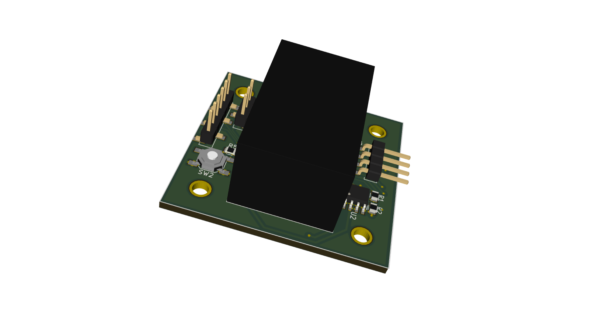

# Introduction
Due to the growing demand of iot devices for home automation this project presents an cheap, easy to use and "open source" alternative to brand Products such as Phillips Hue. Based on the ESP8266-12E, a small WiFi enabled chipset, these devices can be retrofitted in a variety of devices such as light switches, motor controllers and more.

Each home automation node will access your local wifi network and is configurable through a webpage hosted locally on the device itsself. Your network needs to provide a [mqtt](https://pagefault.blog/2017/03/02/using-local-mqtt-broker-for-cloud-and-interprocess-communication/) broker to enable communication between nodes thus enabling its full functionality. An easy to use webinterface as well as a mqtt broker is provided by [Openhab](https://www.openhab.org/).

# Motor Controller
This small module can be mounted on any [Nema17](http://reprap.org/wiki/NEMA_17_Stepper_motor) stepper motor and thereby enabling Wifi functionality. The built in [TMC2130](https://www.trinamic.com/) stepper driver provides virtually silent motor operation as well as resistance detection of the driveshaft. This feature eliminates the need for endstops or any other sensor inputs thus resulting in a small and easy to use form factor. 

The current versions can be found here:
* *no release available*

# License
This work is property of Felix Kübler and is licensed under the
<a rel="license" href="http://creativecommons.org/licenses/by-nc/4.0/">Creative Commons Attribution-NonCommercial 4.0 International License</a>.
